<div align="center">

<!-- Animated Header Banner -->


<!-- Typing Animation -->
<a href="https://git.io/typing-svg"></a>

<br/>

<!-- Quick Badges -->


</div>

---

<br/>

## 🎯 About This Repository

> *A structured, day-by-day learning journey through Python programming fundamentals — building the foundation for Artificial Intelligence & Machine Learning. Each folder is a chapter, each file is a lesson learned.*

```
📍 Current Stage: Python Fundamentals → Core Programming Concepts
🎓 Goal:          Full-stack AI/ML competency
📈 Progress:      ████████░░░░░░░░ 40% (Foundation Phase)
```

<br/>

---

## 📊 Learning Dashboard

<div align="center">

| 📅 Day | 📚 Topic | 🧩 Concepts Covered | 📝 Files | ⚡ Status |
|:------:|:---------|:---------------------|:--------:|:---------:|
| **1** | **Python Basics & Operators** | Variables, Data Types, Operators, Type Conversion, User Input | 3 | ✅ Done |
| **2** | **Control Flow & Functions** | If/Elif/Else, Match-Case, While/For Loops, Functions, Lambda | 2 | ✅ Done |
| **3** | **Strings & Lists** | String Ops, Slicing, Formatting, f-Strings, List Methods | 2 | ✅ Done |
| **4** | **File I/O & JSON** | File Read/Write/Append, Word Search, JSON Module | 9 | ✅ Done |
| **5** | **Advanced File Operations** | File Handling Patterns, Read/ReadLine, Context Managers | 2 | ✅ Done |

</div>

<br/>

---

## 🗺️ Learning Roadmap

```mermaid
graph LR
    A["🐍 Day 1\nPython Basics"] --> B["🔀 Day 2\nControl Flow"]
    B --> C["📝 Day 3\nStrings & Lists"]
    C --> D["📂 Day 4\nFile I/O"]
    D --> E["📁 Day 5\nAdvanced Files"]
    E --> F["🔮 Coming Soon\nOOP & Modules"]
    F --> G["📊 Future\nNumPy & Pandas"]
    G --> H["🤖 Future\nML Algorithms"]
    
    style A fill:#6C63FF,stroke:#4834d4,color:#fff
    style B fill:#6C63FF,stroke:#4834d4,color:#fff
    style C fill:#6C63FF,stroke:#4834d4,color:#fff
    style D fill:#6C63FF,stroke:#4834d4,color:#fff
    style E fill:#6C63FF,stroke:#4834d4,color:#fff
    style F fill:#2d2d44,stroke:#6C63FF,color:#aaa
    style G fill:#2d2d44,stroke:#6C63FF,color:#aaa
    style H fill:#2d2d44,stroke:#6C63FF,color:#aaa
```



<br/>

---

## 📖 Detailed Day-by-Day Breakdown

<details>
<summary><b>🔹 Day 1 — Python Foundations & Operators</b> &nbsp; </summary>

<br/>

### 📌 Topics Covered
| # | Concept | Description |
|---|---------|-------------|
| 1 | **Hello World** | First print statement — the tradition begins |
| 2 | **Variables & Identifiers** | Storing data, naming rules, case sensitivity |
| 3 | **Data Types** | `int`, `str`, `float`, `bool`, `None` |
| 4 | **Keywords** | Reserved words in Python |
| 5 | **Comments** | Single-line `#` and multi-line `'''...'''` |
| 6 | **Style Guide** | snake_case, CamelCase, PascalCase conventions |
| 7 | **Operators** | Arithmetic, Relational, Assignment, Logical |
| 8 | **Operator Precedence** | `()` → `**` → `*/` → `+-` → Comparisons → Logical |
| 9 | **Type Conversion** | Implicit conversion vs Explicit casting |
| 10 | **User Input** | `input()` function with type casting |

### 📁 Files
```
Day 1/
├── 📄 code.py          ← Main lesson notes & examples (185 lines)
├── 📄 Assignment 1.py  ← 10 practice problems solved (106 lines)
└── 📄 temp.py           ← Quick scratch experiments
```

### 💡 Key Assignment Highlights
- Temperature converter (Celsius ↔ Fahrenheit)
- Area calculator using π × r²
- Simple Interest calculator (SI = P×R×T/100)
- Number swapping using temp variable

</details>

<details>
<summary><b>🔹 Day 2 — Control Flow, Loops & Functions</b> &nbsp; </summary>

<br/>

### 📌 Topics Covered
| # | Concept | Description |
|---|---------|-------------|
| 1 | **if / elif / else** | Conditional branching with traffic light example |
| 2 | **Nested Conditions** | Login validation with username + password |
| 3 | **Match-Case** | Python 3.10+ structural pattern matching |
| 4 | **While Loops** | Counter-based repetition, multiplication tables |
| 5 | **Break & Continue** | Loop control statements |
| 6 | **For Loops** | Sequential traversal, character counting |
| 7 | **Range Function** | `range(start, stop, step)` for sequences |
| 8 | **Functions** | `def`, parameters, return values |
| 9 | **Default Parameters** | Non-default vs default function args |
| 10 | **Lambda Functions** | Anonymous functions for simple operations |

### 📁 Files
```
Day 2/
├── 📄 Code.py   ← Comprehensive lesson (259 lines)
└── 📄 temp.py    ← Login system practice
```

### 💡 Code Snippets Spotlight
```python
# 🚦 Traffic Light System
match color:
    case "green":  print("Go")
    case "red":    print("Stop")
    case "yellow": print("Caution")

# 🔢 Lambda for Average
avg = lambda a, b: (a + b) / 2
```

</details>

<details>
<summary><b>🔹 Day 3 — Strings & Lists</b> &nbsp; </summary>

<br/>

### 📌 Topics Covered
| # | Concept | Description |
|---|---------|-------------|
| 1 | **String Basics** | Declaration, `len()`, immutability |
| 2 | **String Indexing** | Positive & negative indices |
| 3 | **String Slicing** | `str[start:end]` substring extraction |
| 4 | **String Formatting** | `.format()` — positional, index-based, keyword |
| 5 | **f-Strings** | Modern literal string interpolation |
| 6 | **Lists** | Mutable sequences, mixed data types |
| 7 | **List Slicing** | Creating sublists with `[start:end]` |
| 8 | **List Methods** | `.append()` and more |

### 📁 Files
```
Day 3/
├── 📄 code.py   ← Strings & Lists deep-dive (74 lines)
└── 📄 temp.py    ← Scratch pad
```

### 💡 Key Insight
> 🔑 *"Strings are **immutable** in Python but Lists are **mutable** — this distinction is fundamental to understanding Python's data model."*

</details>

<details>
<summary><b>🔹 Day 4 — File I/O & Data Handling</b> &nbsp; </summary>

<br/>

### 📌 Topics Covered
| # | Concept | Description |
|---|---------|-------------|
| 1 | **File Opening** | `open()` function with modes (`r`, `w`, `a`) |
| 2 | **Reading Files** | `read()`, `readline()` methods |
| 3 | **Word Search** | Searching for keywords within text files |
| 4 | **JSON Module** | Working with structured data (intro) |
| 5 | **File Modes** | Read, Write, Append operations |

### 📁 Files
```
Day 4/
├── 📄 code.py          ← File I/O basics
├── 📄 assignment1.py   ← Word search in files (13 lines)
├── 📄 JsonModule.py    ← JSON operations (WIP)
├── 📄 sample.txt       ← Sample text data
├── 📄 samplee.txt      ← Additional test data
├── 📄 demoo.txt        ← Demo file for operations
├── 📄 asii.txt         ← Text file for word search
├── 📄 data.json        ← JSON data file
└── 📄 temp.py           ← Quick tests
```

</details>

<details>
<summary><b>🔹 Day 5 — Advanced File Operations</b> &nbsp; </summary>

<br/>

### 📌 Topics Covered
| # | Concept | Description |
|---|---------|-------------|
| 1 | **File Object** | Understanding file objects and pointers |
| 2 | **Read Modes** | `read()` vs `readline()` differences |
| 3 | **File Closing** | Importance of `f.close()` for resource cleanup |
| 4 | **Data Types** | Understanding file data types (`str`) |

### 📁 Files
```
Day 5/
├── 📄 File_I_O.py   ← File handling patterns (27 lines)
└── 📄 data.txt       ← Test data file
```

### 💡 Best Practice Learned
```python
# ✅ Always close files after use
f = open("data.txt", "r")
data = f.read()
f.close()

# 🔜 Next: Context managers (with statement)
```

</details>

<br/>

---

## 📈 Progress & Stats

<div align="center">

```
 ╔══════════════════════════════════════════════════════════════╗
 ║                    📊 CODE STATISTICS                       ║
 ╠══════════════════════════════════════════════════════════════╣
 ║                                                              ║
 ║   Total Lines of Code     ║   ~570+ lines                    ║
 ║   Python Files            ║   11 files                       ║
 ║   Data/Text Files         ║   5 files                        ║
 ║   Assignments Completed   ║   2 (10+ problems)               ║
 ║   Days of Learning        ║   5 days                         ║
 ║   Topics Mastered         ║   25+ concepts                   ║
 ║                                                              ║
 ╚══════════════════════════════════════════════════════════════╝
```

</div>

### 🏆 Skills Progress

```
Python Basics       ████████████████████ 100%  ⭐
Control Flow        ████████████████████ 100%  ⭐
Functions           ████████████████░░░░  80%  🔥
Strings & Lists     ██████████████░░░░░░  70%  🔥
File Handling       ████████████░░░░░░░░  60%  📖
JSON & Modules      ████░░░░░░░░░░░░░░░░  20%  🌱
OOP                 ░░░░░░░░░░░░░░░░░░░░   0%  ⏳
NumPy / Pandas      ░░░░░░░░░░░░░░░░░░░░   0%  ⏳
Machine Learning    ░░░░░░░░░░░░░░░░░░░░   0%  ⏳
Deep Learning       ░░░░░░░░░░░░░░░░░░░░   0%  ⏳
```

<br/>

---

## 🗂️ Repository Structure

```
AIML/
│
├── 📄 README.md                          ← You are here! ✨
├── 📄 .gitignore                         ← Python bytecode exclusions
├── 📄 I want Learn This From Boys -.txt  ← Personal learning goals
│
├── 📂 Day 1/                             ← Python Basics & Operators
│   ├── code.py                           ← Core lesson (185 lines)
│   ├── Assignment 1.py                   ← 10 solved problems
│   └── temp.py                           ← Scratch pad
│
├── 📂 Day 2/                             ← Control Flow & Functions
│   ├── Code.py                           ← Conditionals, Loops, Functions (259 lines)
│   └── temp.py                           ← Login system practice
│
├── 📂 Day 3/                             ← Strings & Lists
│   ├── code.py                           ← String ops, List methods (74 lines)
│   └── temp.py                           ← Experiments
│
├── 📂 Day 4/                             ← File I/O & JSON
│   ├── code.py                           ← File operations intro
│   ├── assignment1.py                    ← Word search program
│   ├── JsonModule.py                     ← JSON module (WIP)
│   ├── data.json                         ← JSON data
│   ├── sample.txt, samplee.txt           ← Test files
│   ├── demoo.txt, asii.txt              ← Practice data
│   └── temp.py                           ← Quick tests
│
└── 📂 Day 5/                             ← Advanced File Handling
    ├── File_I_O.py                       ← File read/write patterns
    └── data.txt                          ← Test data
```

<br/>

---

## 🚀 What's Coming Next

<div align="center">

| 🔮 Upcoming Topic | 📋 Description | 🎯 Priority |
|:------------------|:---------------|:-----------:|
| **OOP in Python** | Classes, Objects, Inheritance, Polymorphism | 🔴 High |
| **Modules & Packages** | `import`, `pip`, virtual environments | 🔴 High |
| **Error Handling** | try/except/finally, custom exceptions | 🟡 Medium |
| **Dictionaries & Tuples** | Advanced data structures | 🟡 Medium |
| **List Comprehensions** | Pythonic one-liners | 🟡 Medium |
| **NumPy** | Numerical computing foundations | 🟢 Planned |
| **Pandas** | Data manipulation & analysis | 🟢 Planned |
| **Matplotlib** | Data visualization | 🟢 Planned |
| **Scikit-Learn** | ML algorithms & pipelines | 🔵 Future |
| **TensorFlow / PyTorch** | Deep learning frameworks | 🔵 Future |

</div>

<br/>

---

## 🛠️ How to Use This Repo

```bash
# Clone the repository
git clone https://github.com/kshitij-shingare/AIML-.git

# Navigate to any day
cd AIML-/Day\ 1

# Run any Python file
python code.py
python "Assignment 1.py"
```

> 💡 **Tip:** Each `code.py` contains detailed inline comments explaining every concept. Read the comments — they're the lecture notes!

<br/>

---

## 🤝 Connect & Collaborate

<div align="center">

[](https://github.com/kshitij-shingare)

<br/>

*If this repo helped you learn something new, consider giving it a ⭐!*

</div>

---

<div align="center">


<br/>

**Made with 💜 and lots of `print("Hello World")` by [Kshitij Shingare](https://github.com/kshitij-shingare)**


</div>
